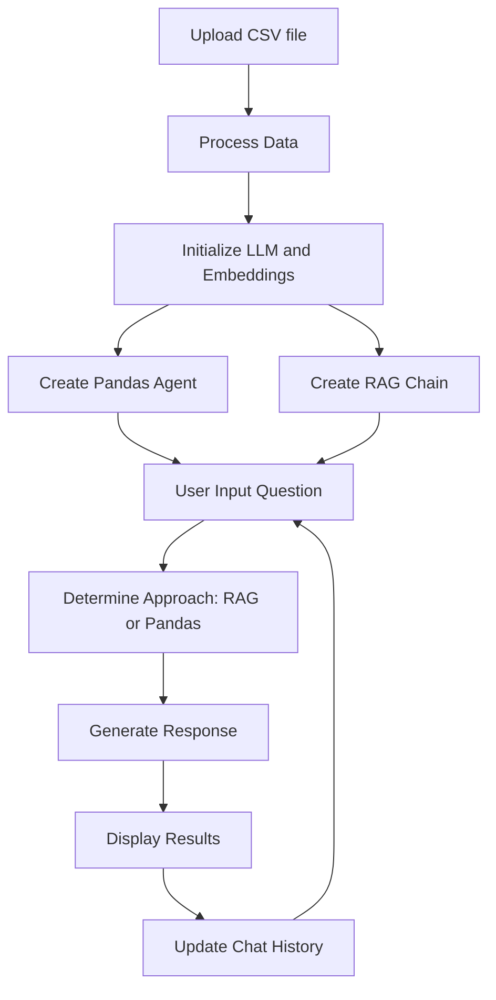

# McDonald's Store Sentiment Performance Analysis App (Demo)

## Preface

Before using this app, it's important to note that a separate sentiment analysis task must be performed on the McDonald's store reviews dataset. This preliminary step classifies the sentiments of customer reviews, which is crucial for the in-depth analysis provided by this app. Ensure that your dataset includes a 'sentiment' column with classified sentiments before proceeding with the analysis in this app.

A sample sentiment analysis using Llama3.1 can be found here:
https://www.kaggle.com/code/yorkyong/sentiment-analysis-with-llama-3-1

## Introduction

The McDonald's Store Analysis App is a powerful tool designed to help McDonald's management gain valuable insights into customer sentiments and store performance across various locations. By leveraging advanced natural language processing and data analysis techniques, this app provides a comprehensive view of customer feedback and store metrics.

### Purpose

The main objectives of this app are:

1. To analyze and visualize customer sentiments across different McDonald's store locations.
2. To identify trends and patterns in customer feedback and store performance.
3. To provide actionable insights that can help improve customer satisfaction and store operations.

### How It Helps Management

This app empowers McDonald's management to:

- Understand customer sentiments at both a broad and granular level.
- Identify high-performing stores and those that need improvement.
- Recognize common themes in positive and negative feedback.
- Make data-driven decisions to enhance customer experience and store performance.
- Track the impact of implemented changes over time.

Question Handling Approach
The app uses a sophisticated two-step approach to handle user questions:
1. LLM-based Approach Selection
When a user asks a question, the app first employs a Large Language Model (LLM) to determine the most appropriate method for answering the question. This decision-making process considers the nature of the question and the type of information required to provide an accurate and comprehensive answer.
The LLM analyzes the question and decides between two main approaches:

PANDAS: For questions requiring specific numerical analysis, statistics, or structured data manipulation.
RAG (Retrieval-Augmented Generation): For questions needing general information, qualitative data, or insights from customer reviews.

2. Question Processing
Based on the LLM's decision, the app then uses one of two approaches to process the question:
PANDAS Approach
If the LLM determines that the question is best answered using structured data analysis:

The app utilizes a Pandas DataFrame agent to perform data manipulation and analysis.
This approach is ideal for questions like "What's the average rating of stores in California?" or "Which store has the highest number of reviews?"
The Pandas agent can perform complex calculations, filtering, and aggregations on the structured data.

RAG (Retrieval-Augmented Generation) Approach
If the LLM decides that the question requires more contextual information or qualitative analysis:

The app uses a RAG chain to retrieve relevant information from the processed customer reviews and generate a comprehensive answer.
This approach is suitable for questions like "What are the most common complaints about the Chicago stores?" or "Summarize the positive feedback for the drive-thru service."
The RAG approach combines the power of retrieval from a knowledge base with the generation capabilities of the LLM.

This dual approach allows the app to handle a wide range of questions, from specific data queries to broad, qualitative analyses, providing management with comprehensive insights into store performance and customer sentiments.

## Process Flow

Here's a simple diagram explaining the flow of the process in the app:



## Setup Instructions

To run the McDonald's Store Analysis App, follow these steps:

1. Clone the repository:
   ```
   git clone https://github.com/yYorky/Mcdonalds-Sentiment-Analysis-App.git
   cd mcdonalds-analysis-app
   ```

2. Create a virtual environment:
   ```
   python -m venv venv
   ```

3. Activate the virtual environment:
   - On Windows:
     ```
     venv\Scripts\activate
     ```
   - On macOS and Linux:
     ```
     source venv/bin/activate
     ```

4. Install the required packages:
   ```
   pip install -r requirements.txt
   ```

5. Set up your environment variables:
   - Create a `.env` file in the root directory
   - Add your Groq API key:
     ```
     GROQ_API_KEY=your_api_key_here
     ```

6. Run the Streamlit app:
   ```
   streamlit run app_multi.py
   ```

7. Open your web browser and navigate to the URL provided by Streamlit (usually `http://localhost:8501`)

## Usage

1. Upload your preprocessed CSV file containing McDonald's store data, including the sentiment analysis results.
2. Select the desired model from the dropdown menu in the sidebar.
3. Adjust the chunk size and overlap settings if needed.
4. Click the "Process Data" button to initialize the vector store and RAG chain.
5. Use the text input field to ask questions about the data or request specific analyses.
6. Explore the results, including the map visualization and chat history.

## Requirements

See `requirements.txt` for a full list of dependencies. Key libraries include:

- streamlit
- groq
- pandas
- plotly
- langchain
- faiss-cpu
- python-dotenv

## Dataset

Dataset is obtained from Kaggle.com
https://www.kaggle.com/datasets/nelgiriyewithana/mcdonalds-store-reviews

## Demo

Here is how the app looks like when running with a user query.

